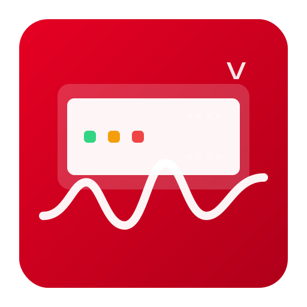

<!doctype html>
<html lang="en">
<head>
  <meta charset="utf-8" />
  <title>Virgin Modem Status – Home Assistant</title>
  <meta name="viewport" content="width=device-width, initial-scale=1" />
  
</head>
<body>

  <header>
    
    <h1>Virgin Modem Status Home Assistant</h1>
    
Unofficial custom integration for Home Assistant that polls a Virgin Media modem at
      <code>http://192.168.100.1/getRouterStatus</code> and exposes simple entities you can use in dashboards and automations
      (e.g., WAN auto-heal / escalation).

  </header>

  <h2>Features</h2>
  <ul class="features">
    <li>One efficient HTTP poll via a <code>DataUpdateCoordinator</code></li>
    <li>Binary sensor for overall DOCSIS health</li>
    <li>Sensor for the latest DOCSIS event + raw message/timestamp attributes</li>
    <li>Works entirely locally (no cloud)</li>
  </ul>

  <h2>Installation</h2>
  <h3>Manual (custom_components)</h3>
  <ol>
    <li>Copy <code>custom_components/virgin_modem_status/</code> into your Home Assistant <code>config/custom_components/</code> folder.</li>
    <li>Restart Home Assistant.</li>
    <li>In HA: Settings → Devices &amp; Services → Add Integration → search <em>“Virgin Modem Status”</em>.</li>
  </ol>

  <h3>HACS (optional)</h3>
  <ol>
    <li>Add this repository to HACS as a custom repository, then install.</li>
    <li>Restart Home Assistant and add the integration from <em>Devices &amp; Services</em>.</li>
  </ol>

  <h2>Configuration</h2>
  
The config flow asks for:

  <ul>
    <li><strong>Host</strong> (default: <code>192.168.100.1</code>)</li>
  </ul>
  
<em>Options (via “Configure” on the integration):</em>

  <ul>
    <li><strong>Scan interval</strong> in seconds (default: <code>90</code>)</li>
  </ul>
  
No credentials are required for the <code>getRouterStatus</code> endpoint.

  <h2>Entities</h2>
  <table>
    <thead>
      <tr>
        <th>Entity</th>
        <th>Type</th>
        <th>Description</th>
      </tr>
    </thead>
    <tbody>
      <tr>
        <td><code>binary_sensor.virgin_modem_docsis_healthy</code></td>
        <td>Binary Sensor</td>
        <td>On when the last DOCSIS event does not indicate a fault (partial service, T3/T4, loss of sync, etc.).</td>
      </tr>
      <tr>
        <td><code>sensor.virgin_modem_last_docsis_event</code></td>
        <td>Sensor</td>
        <td>The latest DOCSIS event text. Attributes include maps of recent <strong>event times</strong> and <strong>messages</strong>.</td>
      </tr>
    </tbody>
  </table>
  
Names may be prefixed with your device name in HA. Unique IDs are stable per config entry.

  <h2>Example: Use in an Auto-Heal Automation</h2>
  <pre><code># Example condition for modem cycle vs WAN renew
- choose:
    - conditions:
        - condition: state
          entity_id: binary_sensor.virgin_modem_docsis_healthy
          state: "off"     # modem reporting trouble
      sequence:
        - service: switch.turn_off
          target: { entity_id: switch.virgin_modem_plug }
        - delay: "00:00:20"
        - service: switch.turn_on
          target: { entity_id: switch.virgin_modem_plug }
  default:
    - service: shell_command.opnsense_wan_renew
</code></pre>

  
You can also include the last event text in logs/notifications:

  <pre><code>{{ states('sensor.virgin_modem_last_docsis_event') }}</code></pre>

  <h2>Troubleshooting</h2>
  

    
Common issues

    <ul>
      <li><strong>Cannot connect / Unknown:</strong> Make sure you can open <code>http://192.168.100.1/getRouterStatus</code> from the HA host’s network. Some ISPs/models expose the page only from the WAN/LAN side directly connected to the modem.</li>
      <li><strong>No entities:</strong> Check <em>Settings → System → Logs</em> for errors from <code>custom_components.virgin_modem_status</code>.</li>
      <li><strong>Frequent “unavailable”:</strong> Increase the <em>Scan interval</em> in Options (e.g., 150–180 seconds).</li>
    </ul>
  

  <h2>Privacy</h2>
  
All requests are made locally to your modem IP. No data leaves your network.

  <h2>Disclaimer</h2>
  
This is an unofficial integration, provided as-is. Virgin Media may change or remove the <code>getRouterStatus</code> endpoint without notice.

  <h2>License</h2>
  
MIT

  

  

    Branding: place <code>images/logo.svg</code> and/or <code>images/logo.png</code> in the repo. For HACS gallery branding, also add PNG/SVG assets under
    <code>brands/custom_integrations/virgin_modem_status/</code> in the <em>home-assistant/brands</em> repo.
  

</body>
</html>
